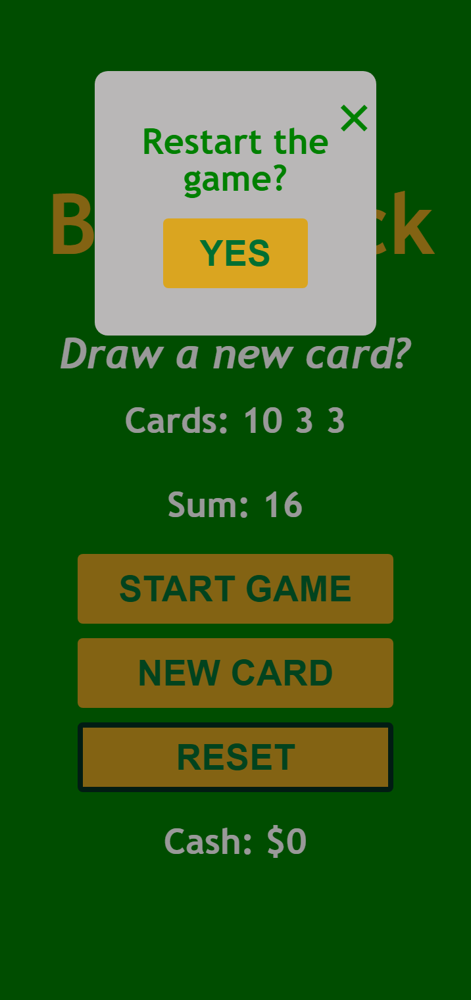

  
  

   
   

## Table of contents

- [Overview](#overview)
  - [Screenshot](#screenshot)
- [My process](#my-process)
  - [Built with](#built-with)
- [License](#License)

## Overview

What this is:

  <h2 align="center">BlackJack Game</h2>

<a href="https://blackjack.netlify.app"><strong>➥ Live Demo</strong></a>

 

## Screenshot

## My process

-Built the html layout
-Styled with css
-Added features with javascript
-Made responsive for all devices

## Built with

- Semantic HTML5 markup
- CSS
- Flex and grid
- Javascript

## License

This project is **free to use** and does not contains any license.
